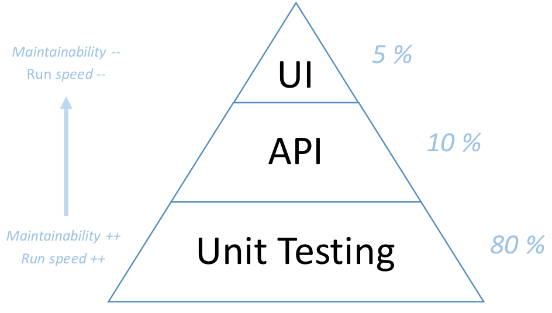

# Software Crafter

- [Software Crafter](#software-crafter)
    - [Sécurité psychologique](#s%C3%A9curit%C3%A9-psychologique)
    - [TDD - Test Driven Development](#tdd---test-driven-development)
        - [Démarrer un projet en TDD](#d%C3%A9marrer-un-projet-en-tdd)
    - [Babystep](#babystep)
    - [Simple Design](#simple-design)
    - [Design Patterns](#design-patterns)
    - [Évolutivité et découplage](#%C3%A9volutivit%C3%A9-et-d%C3%A9couplage)
    - [Types de tests](#types-de-tests)
    - [Test Unitaire FIRST](#test-unitaire-first)
        - [Structure d'un test](#structure-dun-test)
    - [BDD - Behavior Driven Development](#bdd---behavior-driven-development)
    - [Couverture de code](#couverture-de-code)
    - [Mocking](#mocking)
    - [Clean Code](#clean-code)
        - [Les objets](#les-objets)
        - [Les propriétés](#les-propri%C3%A9t%C3%A9s)
        - [Les méthodes](#les-m%C3%A9thodes)
        - [Le code](#le-code)
    - [Refactoring](#refactoring)
    - [Software Craftsmanship](#software-craftsmanship)
    - [Niveaux d'apprentissage](#niveaux-dapprentissage)
    - [Favorites quotes](#favorites-quotes)
    - [TDD et legacy](#tdd-et-legacy)
        - [Je fais ça bien](#je-fais-%C3%A7a-bien)
        - [Je dois faire mon code dans cette classe](#je-dois-faire-mon-code-dans-cette-classe)
        - [TDD sur un existant pas testable](#tdd-sur-un-existant-pas-testable)
    - [Comment diffuser le TDD ?](#comment-diffuser-le-tdd)
    - [Dois-je développer ou acheter ?](#dois-je-d%C3%A9velopper-ou-acheter)
    - [Architecture orientée métier](#architecture-orient%C3%A9e-m%C3%A9tier)
        - [DDD - Domain Driven Development](#ddd---domain-driven-development)
        - [Architecture DDD](#architecture-ddd)
        - [CQRS - Command Query Responsability Segregation](#cqrs---command-query-responsability-segregation)
        - [Event-Sourcing](#event-sourcing)
        - [Tests BDD en GWT](#tests-bdd-en-gwt)
    - [Agilité](#agilit%C3%A9)
        - [Problèmes](#probl%C3%A8mes)
        - [Solution](#solution)
        - [Daily](#daily)
    - [Code Review](#code-review)

## Sécurité psychologique

__Objectif__ : une équipe performante

__Le + important__ : la sécurité psychologique

__La raison :__ Si on se sent bien dans son équipe et qu'on se fait confiance alors on ose prendre des risques !
_(voir [étude google](https://rework.withgoogle.com/guides/understanding-team-effectiveness/steps/identify-dynamics-of-effective-teams/))_

__Quelques règles :__
- Bienveillance __envers l'autre__ :
    1. Essayer de comprendre sans juger et veiller à ce que la personne se sente bien
    2. Ne jamais dénigrer une personne ni son travail, même pour rire
    3. Prendre le temps d'expliquer : il n'y a rien d'évident
    4. Rester humble face à l'existant : le développeur a fait de son mieux à un instant T avec les informations qu'on lui a donné
    5. Être un soutien dans les phases d'apprentissages : elles sont très frustrantes
    6. Savoir dire merci
   
- Bienveillance __envers soi-même__ :
    1. On ne fait jamais bien du premier coup mais il faut avoir du courage pour démarrer
    2. Le code, c'est comme les maths, ça paraît toujours simple une fois qu'on a compris
    3. Les phases d'apprentissage sont toujours frustrantes mais on en ressort grandi
    4. Les échecs sont les meilleurs apprentissages
    5. Ne pas se comparer : malgré toutes ses compétences, un expert peut rendre son code complexe donc inmaintenable
    6. Il faut être intolérant avec l'intolérence, refuser le dénigrement


## TDD - Test Driven Development

__C'est quoi :__ _Développement dirigé par les tests_

__Avantages :__

- Avoir rapidement des cas métiers qui fonctionnent
- C'est mettre un parachute avant de sauter
- L'architecture est déduite et peut évoluer avec le métier qui change

__Principe :__

1. __Red__ - Écrire un test qui fail
2. __Green__ - Faire passer le test au vert
3. __Refactor__ - Refactorer le code _(tests compris)_


__Quoi tester ?__

Le comportement métier attendu, en s'isolant des appels externes et persistances

### Démarrer un projet en TDD

_Important : Tout doit être nommé avec du vocabulaire métier, pas de vocabulaire technique_

__Initialisation__
1. Créer un projet de test
2. Créer une classe de test
3. Créer une 1ère méthode de test vide
4. Faire une assertion entre true et false : 

1. Remplacer false par true : 
2. Pas besoin de refacto : 

__1er test métier__
1. Appel à un objet métier inexistant :  _[ne compile pas]_
2. Créer le projet métier & générer la classe vide : 
3. Appel à une méthode métier qui n'existe pas :  _[ne compile pas]_
4. Générer la méthode : 
5. Faire une assertion sur une valeur métier attendue : 
6. Dans la méthode métier, retourner la valeur en dur : 
7. Pas besoin de refacto : 

__2ème test métier__

1. Ajouter une 2ème méthode de test avec une autre valeur attendue : 
2. Dans la méthode métier se contenter d'ajouter un if avec la nouvelle valeur attendue : 
3. Pas besoin de refacto : 

__3ème test métier__

1. Ajouter une 3ème méthode de test avec une autre valeur attendue : 
2. Dans la méthode métier ajouter un 2ème if : 
3. Le code ne respecte pas le simple design, il faut refacto : 

Un if-else ou un switch-case peut être remplacé par un dictionnaire ou un pattern strategy

__Etc.__

_Conseil : finir sa journée sur un test rouge permet de reprendre plus facilement le lendemain_

## Babystep

__Principe__ :
Pour faire passer un test au vert, faire la modification la plus simple possible  
_Exemple : retourner la valeur en dur, ajouter seulement un if_  

__Si c'est pas simple__ : le cas testé est peut-être trop complexe. Il faut trouver un cas intermédiaire plus simple à résoudre

__C'est sale__ : Une fois au vert, si le code ne respecte pas le Simple Design, c'est le moment de refacto ! Les tests sont là pour s'assurer que les modifications ne cassent rien

## Simple Design

Le Simple Design, c'est 4 règles :
- Tous les tests passent
- Code expressif
- Pas de duplication
- Code minimal

Accronymes à se remémorer en boucle :
- __DRY__: Don't Repeat Yourself
- __YAGNI__: You Ain't Gonna Need It!
- __KISS__: Keep It Simple, Stupid!

## Design Patterns

Les patterns de conception sont des méthodes pour répondre à des problématiques récurrentes.

Le but n'est pas d'en mettre de partout mais de les connaître pour se répondre rapidemment à des problèmes déjà connus : https://sourcemaking.com/design_patterns

## Évolutivité et découplage

Votre code sera évolutif et facilement testable s'il est découplé. Voici quelques principes :

- __Single Responsability Principle__: un objet a une seule responsabilité _(lecture, écriture, règle métier, orchestration, ...)_
```csharp
Class DeliveryTime {
    int GetDeliveryTime(TransportType type, Date date) { }
}
```

- __Interface Segregation__: on travaille avec une interface (contrat) pour s'isoler d'une implémentation spécifique et pouvoir en changer facilement  
```csharp
Interface IItemRepository {
    public SaveItem();
    public GetItem(int itemId);
}

Class DeliveryTime {
    IItemRepository repo = new CassandraItemRepository();
}
```
- __Dependency Injection__: l'interface est placée en paramètre du constructeur.
Ça a deux intérêts : 
    - Pour les tests : on pourra avoir une implémentation vide des sous-objets manipulés pour ne tester que la classe en cours
    - Dans notre application : on peut remonter le choix des implémentations à un seul endroit pour en changer rapidement _(ex: un type de base de données)_

        *Info : c'est une implémentation de l'__Inversion Of Control (IOC)__ traduit par le principe d'Hollywood "Ne nous appelez pas, c'est nous qui vous appelleront"*

```csharp
class DeliveryTime
{
    public DeliveryTime(IItemRepository repository) { }
}
```

- __IOC Container__: plutôt que de créer tous les objets en début de programme, on peut utiliser un conteneur IOC qui connaîtra toutes les implémentations et les instanciera au moment voulu
```csharp
services.AddSingleton<IItemRepository, CassandraItemRepository>();
```

_Pour compléter, tous les [principes SOLID](http://www.arolla.fr/blog/2017/02/principes-solid-vie-de-jours/)_

## Types de tests



__Unit Testing__ : valide le comportement métier d'un composant isolé

__API__ : valide le comportement attendu par le consommateur de l'API _(ex: tests Pact)_

__UI__ : valide une fonctionnalité du point de vue utilisateur

## Test Unitaire FIRST

Un bon test unitaire doit être __FIRST__, c'est-à-dire :
- __Fast__: rapide à exécuter pour lancer très souvent et valider la non régression
- __Independant__: doit être totalement isolé
- __Repeatable__: ne doit pas avoir de comportement aléatoire, ni dépendre d'un composant externe pour continuer à être valide
- __Self-Validating__: doit porter l'erreur sans qu'il y ait besoin de débugguer ou d'ouvrir des logs
- __Timely__: doit être maintenu dans le temps et doit tester les nouveaux comportements  

_On ne se contente pas d'enlever les tests qui ne passent plus !_

### Structure d'un test

Un test untaire peut suivre la structure __AAA__ :
- __Arrange__: Intialisation des paramètres et valeurs de retours
- __Act__: Appel à la méthode testée
- __Assert__: Vérification du comportement attendu

## BDD - Behavior Driven Development

__C'est quoi__ : alternative au TDD, les tests sont des comportements utilisateurs

__Avantages__ : 
- Ils peuvent être fait en suivant une structure GWT (Given-When-Then)
- Ils peuvent être écrit dans un langage compris par tout le monde _(ex: Gherkin)_

__Inconvénient__ : 
- On se retrouve vite en pyramide inversée avec 80% de tests UI
- Les tests sont lent à s'exécuter et impactés à modification

## Couverture de code

Certains outils permettent de connaître les lignes testées  

__Avantage__ : repérer les zones de codes oubliés que l'on aurait voulu tester  
__Danger__ : si l'on impose une couverture minimale, on encourage à faire des tests globaux et non à tester chaque comportement  
__A retenir__ : il faut tester les comportements métiers, cela aboutira à une bonne couverture de code sur les éléments importants

## Mocking

Un mock c'est une __implémentation "à vide"__  
Par injection de dépendance, on passe ce comportement à la classe à tester : __son comportement est isolé__

Il existe plusieurs types de "mock" :
- Dummy: coquille sans comportement
- Stub: retourne des données attendues
- Fake: implémentation simplifiée de la classe originale
- Spy: enregistre des informations comme les appels
- Mock: contient une substitution complète de la classe à tester

Pour faciliter cela, n'hésitez pas à utiliser un framework de mock

## Clean Code

__90% des problèmes sont résolus par le nommage !__

Nommer directement avec le vocabulaire métier _(ibiquitous language)_ aide à séparer les responsabilités. Le code peut alors évoluer avec le métier qui change

### Les objets

- Pas de "God Object" : Manager, Helper, Handler
- Donc pas d'objet anémique : structure sans comportement
- Pas d'objet technique : orchestrateur, mapper
- Seulement des objets de notre langage métier

### Les propriétés

- Pas de getter/setter public mais des méthodes _(actions métier)_ qui les manipulent
- Pas de nommage technique

### Les méthodes

- Réprésente une action métier
- Ne pas modifier un paramètre mais créer une variable intermédiaire
- Préférer les conditions de sorties en début de méthode _(if-then-return & if-then-throw)_ pour éviter les niveaux d'indentation _(arrow antipattern)_
- Limiter la mutation de propriété de classe

### Le code  

- ___Si on se contente de lire à gauche du signe égal, on doit comprendre le code___
- Une condition _(if)_ ne doit contenir aucun calcul ou test, il faut passer par un booléen métier _(ex: isDiceRolled, doesHaveScore)_
- Un commentaire montre que le code n'est pas clair
    - Pour un bloc : l'extraire dans une méthode bien nommée
    - Pour une ligne de code : ajouter des variables intermédiaires
- La documentation n'est utile que : 
    - Si l'on fourni le code sous forme de librairie
    - Pour les classes à exposer
- Ne pas utiliser des types primitifs (bool, string, etc.) mais les wrapper dans des value-object
    - Pour le booléen, utiliser un enum vous sauvera la vie quand un nouvel état apparaîtra
- Ne pas utiliser de système de flags, ce sont des comportement différents donc isolés

## Refactoring

Le code legacy c'est toi !  
Il faut oser séparer les responsabilités et donc créer des nouveaux objets

Pour les techniques, voici d'excellentes ressources :
- https://sourcemaking.com/refactoring
- https://refactoring.guru/refactoring/techniques

## Software Craftsmanship

Pour se former, il existe plusieurs formats (par ordre de préférence) :
1. __Coding Dojo__ : au format de katas (http://codingdojo.org/KataCatalogue/) ou randori, ça permet d'échanger, de pratiquer, d'apprendre le TDD en pair-programming ou en mob-programming
2. __Formation en école__ : processus complet mais long, parfois cher, et compliqué quand on a déjà commencé à travailler
3. __Événements__ : regroupe beaucoup de sujets, souvent avec des ateliers mais parfois cher et limité aux grandes villes. Parfois il sont enregistrés en vidéo (https://www.infoq.com/fr)
4. __Meet-Up__ : conférence autour d'un sujet, permet d'apprendre et de partager avec d'autres experts
5. __Forum Ouvert__ : c'est un format assez libre pour échanger, découvrir et apprendre sans se limiter à son contexte professionnel ni même technique
6. __BBL__ _(Brown Bag Lunch)_ : permet de faire venir des experts pendant la pause déjeuner
7. __Live Coding__ : présentation de coding par un développeur pour apprendre de ses techniques
8. __News__ : important pour suivre les nouveautés, permet de s'ouvrir et découvrir (ex: developpez.com)
9. __Tutoriel__ : apprentissage pratique grâce à une vidéo autour d'un concept, la difficulté c'est d'apprendre seul
10. __Coding Game__ : exercices d'algorithmique à réaliser en 'quick and dirty'. À l'opposé de toute bonne pratique, ça permet tout de même de travailler sa logique et ses algos

## Niveaux d'apprentissage

Établi par Maslow :

1. __II (Inconscient / Incompétent)__  
    Un débutant peut se croire expert s'il n'a pas conscience de l'étendue de l'apprentissage
2. __CI (Concient / Incompétent)__  
   C'est l'étape la plus importante, on se rend compte de tout ce qu'il y a à découvrir
3. __CC (Conscient / Compétent)__  
   Avec l'apprentissage on finit pas se savoir bon même s'il reste toujours des choses à apprendre
4. __IC (Inconscient / Compétent)__
   Avec la pratique on finit par créer des automatismes et à ne plus avoir conscience de ses compéttences qui sont pourtant bien là

## Favorites quotes

Martin Fowler
```
Any fool can write code that a computer can understand. Good programmers write code that humans can understand

```
_Unknown_
```
Le code c'est comme une blague : s'il y a besoin de l'expliquer c'est qu'il n'est pas bon
```

The Pragmatic Programmer - Andrew Hunt & David Thomas
```
It’s not at all important to get it right the first time. It’s vitally important to get it right the last time
```

Uncle Bob Martin
```
No matter how slow you are writing clean code, you will always be slower if you make a mess
```

Wes Dyer
```
Make it correct, make it clear, make it concise, make it fast. In that order
```

Roberto Waltman
```
The object-oriented version of spaghetti code is, of course, 'lasagna code'. Too many layers
```

Louis Srygley
```
Without requirements and design, programming is the art of adding bugs to an empty text file
```

Paul Graham
```
In programming, the hard part isn’t solving problems, but deciding what problems to solve
```

Ryan Singer
```
So much complexity in software comes from trying to make one thing do two things
```

Jon Franklin
```
Simplicity carried to the extreme becomes elegance
```

## TDD et legacy

__Avant de parler méthode, il faut maîtriser le TDD au travers de Coding Dojos !__

_Important : il faut s'assurer de mettre l'évolution au bon endroit, c'est-à-dire avec la même responsabilité  
Le risque c'est de faire du temporal Coupling : "ça doit s'exécuter entre ça et ça"  
Il ne faut pas confondre responsabilité et orchestration_

### Je fais ça bien

1. Essayer de comprendre comment fonctionne l'existant
2. Coder les Tests Unitaires de ce que l'on comprend :   
   _astuce : utiliser un outil de code coverage pour s'assurer que tout le code est pris en compte_
3. Refacto potentielle 
4. Coder les Tests Unitaires du nouveau comportement : 
5. Coder le nouveau comportement :   
6. Refacto potentielle 


### Je dois faire mon code dans cette classe

- Si c'est une nouvelle fonctionnalité qui a la même responsabilité que l'existant :  
__Sprout Method__ : en TDD, implémenter la fonctionnalité dans une nouvelle méthode

- Si c'est une nouvelle fonctionnalité aussi importante que le code existant, et avec la même responsabilité :  
__Wrap Method__ : sortir tout le code de la méthode existante dans une nouvelle méthode. Faire une nouvelle méthode en TDD. Appeler les deux méthodes depuis l'existante

_Avant_
```csharp
void MyMethod() { // Method
    DoSomethingLegacy(); // LegacyCode
}
```

_Après_
```csharp
// Après
void MyMethod() { // Method
    DoOldThing();
    DoNewThing();
}

void DoOldThing() {
    DoSomethingLegacy(); // Legacy Code
}

void DoNewThing() {
    DoSomethingClean();
}
```

- Si c'est une nouvelle fonctionnalité avec un comportement différent, si la classe est trop longue ou avec déjà trop de responsabilités :  
__Wrap Class__ : utiliser le design pattern decorator

### TDD sur un existant pas testable

Il faut trouver les modifications minimales à opérer sans risque _(outils de refacto automatisée comme Resharper)_ qui permettront de la rendre testable :

- __Découper une méthode__ :  
Regardez les niveaux d'indentations (for, if, ...) les groupes d'éléments représentent souvent des comportements distincts.  
Sortez le dans une nouvelle méthode nommée avec le comportement métier.  

- __Dépendances ingérables__ :  
Si vous avez fait l'étape 1, vous devriez en avoir beaucoup moins par méthode.  
Sinon, placez les classes dépendantes en paramètre pour pouvoir les mocker

- __Paramètres modifiés en cours de route__ :  
Insérez des variables intermédiaires pour isoler les paramètres.
Ainsi, on aura des méthodes de calcul qui seront séparées de celle d'orchestration : les responsabilités pourront être séparées dans des classes différentes

## Comment diffuser le TDD ?

Espérer trouer l'équipe parfaite ne fonctionne pas, il faut la créer

- En étant convaincu soit-même
- En ayant éprouvé par la pratique (Coding-Dojo)
- En Pair-Programmant et en montrant l'intérêt
- En cherchant l'intérêt du développeur que l'on veut motiver
- En faisant expérimenter le Marshmallow Challenge
- En encourageant les devs à partager leurs bonnes pratiques
- En organisant des Coding Dojo et en communiquant sur son intérêt
- En proposant un parcours formateur : comme le [Software Craftmanship coaching de Pedro Santos](https://youtu.be/IldHwKQiDME)

## Dois-je développer ou acheter ?

Questions à se poser :
- Est-ce que cela amène une valeur ajoutée pour notre business (rentable) ?
- Est-ce compliqué à développer ?
  
En fonction des réponses :
- Si aucune valeur ajoutée : essayer d'acheter un outil externe
- Si valeur ajoutée et pas compliqué : le faire développer par un débutant pour qu'il monte en compétence
- Si valeur ajoutée et compliqué : c'est parti !

## Architecture orientée métier

### DDD - Domain Driven Development

Le DDD c'est le fait de driver le design de l'application par domaine métier.

Le développeur doit parler le même langage que l'expert fonctionnel _(ibiquitous language)_ et son programme doit refléter ce fonctionnement et ce vocabulaire.

Ainsi on détache le système par périmètres fonctionnels et les règles métier sont totalement isolées

__Une personne non-technique doit pouvoir pair-programmer et comprendre ce qu'il s'y passe__

### Architecture DDD

Des architectures ont été proposées pour reprendre ce principe. On retrouve notamment l'architecture hexagonale que je ne vais pas expliciter ici.

Voici une architecture DDD basée sur les API :
- __Domain Model Layer__ : contient toute la logique métier.  
Elle est isolée de tout le reste du système et définit les interfaces (comportements attendus) pour les utiliser sans connaître l'implémentation

- __Infrastructure Layer__ : contient toute la logique technique  
Elle connaît le domain pour implémenter les interfaces mais ne le manipule pas  
_Exemples : manipulation persistance, transformations, appels externes)_

- __Application Layer__ : point d'entrée de l'API, elle orchestre le domain et l'infrastructure et injecte les implémentations au domain


### CQRS - Command Query Responsability Segregation

Pour les systèmes qui font du 80 % lecture / 20 % écriture, pour gagner en performance, on va vouloir séparer :
- La logique de modification : __command__
- La logique de lecture : __query__

__Command__ : dans notre architecture DDD, le domain va être utilisé pour faire de la validation et du calcul

__Query__ : si la persistance contient déjà les données au bon format, l'application peut appeler directement l'infrasructure pour les demandes de lecture

Et comme les données ne sont pas toujours au bon format et pour alléger au maximum la persistance, on va rajouter un système de projection (projection engines) qui va écrire dans un cache (Read Cache) qui fera encore gagner en performance.

_Attention: dans ce schema, l'UI est en bas_  


### Event-Sourcing

Dans certains cas, ce qui nous intéresse ce n'est pas tant l'état final mais les évènements qui se sont produits _(ex : un compte en banque)_  

Dans ce cas, le domain (write model) a pour rôle de :
- Vérifier, en fonction de son état, si la commande peut être appliquée
- Si non, il peut lever une exception ou ne rien faire
- Si oui, elle va appliquer des évènements, c'est-à-dire des informations immutables sur ce qui s'est passé`
- Ces évènements seront stockés dans un event-store

Le rôle du 'projection engine' sera de désérialiser ces évènements en données au format de la lecture

_De nombreux autres schemas existent et rajoutent un command handler et des bus de données. Cela dépendra de l'isolation que l'on souhaite donner entre ces acteurs_

### Tests BDD en GWT

Il sera très simple de faire des tests de comportement avec les commandes et les évènements :
- __Given__ : étant donné les évènements qui se sont produits
- __When__ : quand la commande arrive
- __Then__ : alors il est sensé se passer ça (rien, exception, évènement)

## Agilité

### Problèmes

- Stand-up interminable
- Difficile de chiffrer les tâches
- Projets pas agiles : une tâche à faire, un temps alloué, une date de fin
- Trop d'interlocuteurs
- Dépassement sur chaque sprint

### Solution

- Arrêter le mode projet
- Partir d'une idée
- Etre ouvert et essayer : si ça marche on continue
- Des équipes limitées à 4 personnes autour d'une idée

_Minimal Viable Product_  


### Daily

- Se mettre d'accord sur une petite tâche
- Pair/Mob/Programming
- Test
- Démo
- Déploiement
- Rentrer chez soit

## Code Review

La relecture de code n'est pas une barrière de validation de code, c'est un __échange dans l'équipe__

Ça se fait en binôme avec le développeur qui explique ce qu'il a voulu faire. L'échange permet :
- La monté en compétences d'un autre membre de l'équipe
- Au relecteur de faire des retours
- Au développeur de critiquer sa démarche (sur le même principe que la [méthode du canard en plastique](https://www.pressmyweb.com/geek-nouvelles-technologies/methode-canard-plastique-mieux-developper/))

Les bugs peuvent être corrigés immédiatement et les idées d'évolution intégrées au backlog

On peut se passer de la code review par le pair-programming